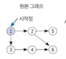
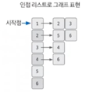
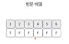
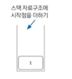

## DFS(깊이 우선 탐색) 개념

그래프 완전 탐색 기법 중 하나로, 그래프의 시작 노드에서 출발하여 탐색할 한쪽 분기를 정하여
최대 깊이까지 탐색을 마친 후 다른쪽 분기로 이동하여 다시 탐색을 수행하는 알고리즘이다.

[ 시간 복잡도 : O(V+E) _ (노드수:V, 엣지 수:E) ]

1) 재귀 함수로 구현

2) 스택 자료구조 이용 (DFS 는 FILO 형태를 가짐 )

실제 구현시 재귀 함수를 이용하므로 스택 오버플로우를 유의해야 한다. 
ex) 단절점 찾기, 단절선 찾기, 사이클 찾기, 위상 정렬 등이 있다  

🖐 DFS는 한 번 방문한 노드를 다시 방문하면 안되므로 노드 방문 여부를 체크할 배열이 필요하다  
그래프는 인접 리스트로 표현을 많이한다, 그리고 DFS 의 탐색방식은 후입선출 특성을 가지므로 스택 자료구조를 사용한다  

📌 스택을 사용하기는 하지만, 대부분 재귀함수를 많이 사용을 한다.  

### 1) DFS 를 시작할 노드를 정한 후 사용할 자료구조 초기화하기
  
1) 인접 리스트로 그래프 표현하기(인접리스트: 내 노드에서 갈 수있는 루트가 뭐가 있지?)  

2) 방문 배열 초기화하기  
  
3) 시작 노드 스택에 삽입하기
   - 스택에 시작 노드를 삽입하면, 해당 시작 노드의 방문 배열은 첫번째 노드를 제외하고는 다 false 이다  
 

### 2) 스택에서 노드를 꺼낸 후 꺼낸 노드를 다시 스택에 삽입하기.
- pop(제일마지막에 들어간것) 을 수행하여 노드를 꺼낸다.
- 꺼낸 노드를 탐색 순서에 기입하고 인접 리스트의 인접 노드를 스택에 삽입하며 방문 배열을 체크합니다
- 이제 방문 배열은 T T T F F F 가 된다. 

### 3) 스택 자료구종 값이 없을 때 까지 반복하기
위 과정을 스택 자료구조에 값이 없을 때 까지 반복을 한다. 이때 이미 다녀간 노드는 방문 배열을 바탕으로 재삽입하지 않는 것이 핵심이다  

### 4) Stack 안이 다 비게되면 dfs 가 종료된다.

스택에 노드를 삽입할 때 방문 배열을 체크하고, 스택에서 노드를 뺄 때 탐색 순서에 기록하며  
인접 노드를 방문 배열과 대조(이미 방문한 노드면 스택에 넣지않고, 방문 안한 노드만 스택에 넣는다) 하여 살펴본다.

