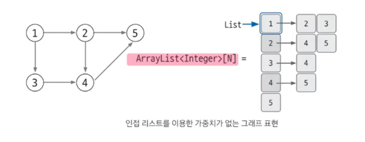
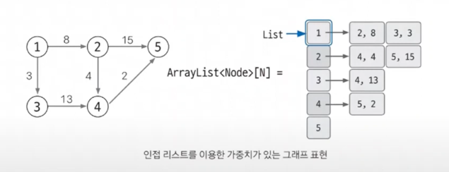

# 그래프
그래프는 노드와 엣지로 구성된 집합이다  
- 노드는 데이터를 표현하는 단위이고, 엣지는 노드를 연결한다.
트리 또한 그래프의 일종이다  

### 1) 그래프 알고리즘
1) 그래프 표현
2) 유니온 파인드
   - 그래프의 사이클이 생성되는지 판별하는 알고리즘
     - 즉, 사이클 유무 판단 
3) 위상 정렬
   - 선 조건: 사이클 X, 방향이 있는 그래프 여야 한다.
   - 그래프의 노드들을 선형으로 정리하는 거라고 보면 된다.
   - 값이 유일하지 않다는 특징이 있다.
   - 정렬 결과가 꼭 1개는 아니다. 여러개 일 수도 있다.
   - 대표적인 문제로는, 수강 신청이 있다.
   - 전 후 관계가 있는 문제일 경우 위 알고리즘으로 풀 수 있다.
     - ex) 수강신청, 팩토리를 지어야 탱크를 뽑을 수 있고, BF가 있어야 무한의 대검을 만들 수 있다.
 
다익스트라,벨만포드,플로이드-워셜은 모두 최단 거리 알고리즘 이다

4) 다익스트라
       - 음수 간선은 No
       - 시작점이 있고, 다른 모든 노드로 가능, 최단 거리를 구하는 알고리즘
5) 벨만 포드
     - 음수 간선도 OK 
     - ex) 시간 여행이 가능한지?

음수간선이 있으면 벨만 포드, 음수 간선이 없으면 다익스트라 사용  

6) 플로이드-워셜
     - 시작점이 없고, 임의의, 모든 노드 쌍에 대하여 최단거리를 구한다.
     - 시간 복잡도가 좋지가 않다..
7) 최소 신장 트리
   - 사이클이 없다.
   - 그래프에서 최소의 가중치 합으로 모든 노드를 연결할 수 있게 해주는 알고리즘
   - 최소 신장 트리안에 유니온 파인드 알고리즘을 구현하는 방법이 있다.

### 2) 그래프 표현 
그래프 알고리즘은 풀기 위해서 그래프를 자료구조에 적절하게 담지 못하면 문제 자체를 접근할 수가 없다  
엣지는 선, 노드는 점 을 의미한다  

#### 그래표 표현 방법 1. 에지 리스트
에지 리스트는 에지를 중심으로 그래프를 표현한다. 에지 리스트는 배열에 출발 노드, 도착 노드를 저장하여 에지를 표현 한다.  

- 에지 리스트로 가중치 없는 그래프 표현하기
가중치가 없다면 배열의 행은 2개면 충분하다  

- 에지 리스트로 가중치 있는 그래프 표현하기
가중치가 있다면 그래프는 행을 3개로 늘려 3번 째 행에 가중치를 저장하면 된다  
보통 코딩 테스트에서는 [시작][종료][가중치] = [S] [E] [V] 이런 식으로 표현을 한다  

위 방법은 특정 노드와 관련되어 있는 에지를 탐색하기는 쉽지 않다  
Ex) 벨만 포드, 크루스칼 알고리즘에 사용한다  

노드 중심 알고리즘에는 잘 사용하지 않는다  

#### 그래표 표현 방법 2.인접 행렬
2차원 배열을 자료구조로 이용하여 그래프를 표현한다  
Ex) 노드가 5개인 그래프면 [5][5] 인접 행렬로 표현한다는 말이다.  

인접 행렬은 인덱스를 이용해 시작 노드 및 종료 노드를 표현한다 그리고 에지 리스트와 다르게 노드 중심으로 그래프를 표현한다  
ex) 3 -> 4 로 가는 겹치는 부분을 엣지가 있다고 표현하고 그 부분에 가중치를 표현한다  

- 인접 행렬로 가중치 있는 그래프 표현하기

하지만 노드와 관련되어 있는 에지를 탐색하려면 N 번 접근해야 하므로 노드 개수에 비해 에지가 적을 때 공간 효율성이 떨어진다  
또한 노드 개수가 많은 경우 아예 2차원 배열 선언 자체를 할 수 없는 결함도 있다  

따라서 인접 행렬은 노드 개수에 따라 사용 여부를 적절하게 판단하는 능력도 필요하다  

#### 그래표 표현 방법 3.인접 리스트
인접 리스트는 ArrayList 로 그래프를 표현합니다  
노드 개수만큼 ArrayList 를 선언합니다. 자료형은 보통 Integer 를 사용한다.  

> 1. 인접 리스트로 가중치 없는 그래프 표현하기

  

List 자료구조는 배열과 다르게 가변적이기 때문에 유효하게 사용할 수 있다  
Index 를 통해 직접 접근이 가능하기 때문에 좋다  

> 2. 인접 리스트로 가중치 있는 그래프 표현하기

보통 코딩테스트에는 가중치가 주어진다, 그러므로 사실 위 방법을 잘 이해하고 있어야 한다.  
가중치가 있는 경우, 자료형을 Integer 가 아닌 클래스(=객체) 를 사용한다  
  

그래프를 구현하는 다른 방법에 비해 인접 리스트를 이용한 그래프 구현은 복잡하다  
하지만 복잡한 만큼 성능이 다른 방법에 비해 뛰어나다  

배열에 빈공간을 탐색하는 것이 없으니, 노드와 연결되어 있는 에지를 탐색하는 시간은 매우 뛰어나다  
공간 효율이 좋아 메모리 초과 에러도 발생하지 않는다  
이런 장점 때문에 '인접 리스트' 를 이용한 그래프 구현을 선호 한다.

### REF
> https://www.youtube.com/watch?v=D_ZuvwIkinQ&t=5s  
